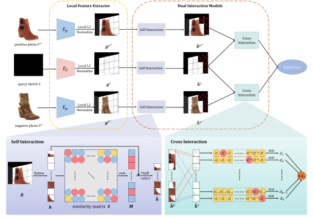

# DLI-Net
Pytorch implementation of "DLI-Net: Dual Local Interaction Network for Fine-Grained Sketch-Based Image Retrieval". DLI-Net is the improved version of "DLA-Net for FG-SBIR: Dynamic Local Aligned Network for Fine-Grained Sketch-Based Image Retrieval". So you can also refer this code to implement DLA-Net.

## Environment
- python 3.8
- pytorch 1.9

## Structure


## Datasets
There are six datasets used in our paper. To train our DLI-Net, you need change the parameters of `*.sh` (e.g. `ph_train_root` and `ph_train_txt`). It is important to note that the folder structures of datasets need to be consistent with ours, otherwise you need to modify the code accordingly. Our folder structures are shown below.

- QMUL-Shoe-v1/QMUL-Chair-v1/QMUL-Handbag
    ```
    dataset_name
    ├── photo
    │   ├── 1.jpg
    │   └── ...
    ├── sketch
    │   ├── 1.png
    │   └── ...
    ├── photo_test_name.txt
    ├── photo_train_name.txt
    ├── sketch_test_name.txt
    └── sketch_train_name.txt
    ```

- QMUL-Shoe-v2/QMUL-Chair-v2
    ```
    dataset_name
    ├── photo_test.txt
    ├── photo_train.txt
    ├── sketch_test.txt
    ├── sketch_train.txt
    ├── testA
    │   ├── 2429245009_1.png
    │   └── ...
    ├── testB
    │   ├── 2429245009.png
    │   └── ...
    ├── test_noise
    │   ├── 1445100078_2_mask1.png
    │   └── ...
    ├── trainA
    │   ├── 1031000079_1.png
    │   └── ...
    ├── trainB
    │   ├── 1031000079.png
    │   └── ...
    └── train_noise
       ├── 1445100078_2_mask1.png
       └── ...
    ```

- Sketchy

    For this dataset, we first remove the invalid images based on the files in the folder of `info`.
    ```
    Sketchy
    ├── info
    │   ├── invalid-ambiguous.txt
    │   ├── invalid-context.txt
    │   ├── invalid-error.txt
    │   ├── invalid-pose.txt
    │   ├── README.txt
    │   ├── stats.csv
    │   ├── strokes.csv
    │   ├── testset.txt
    │   └── urls.txt
    ├── photo
    │   └── tx_000100000000
    │       ├── split_test_train.py
    │       ├── test
    │       │   ├── airplane
    │       │   │    ├── n02691156_1512.jpg
    │       │   │    └── ...
    │       │   └── ...
    │       └── train
    │           ├── airplane
    │           │    ├── n02691156_58.jpg
    │           │    └── ...
    │           └── ...
    ├── sketch
    │   └── tx_000100000000
    │       ├── test
    │       │   ├── airplane
    │       │   │    ├── n02691156_1512-2.png
    │       │   │    └── ...
    │       │   └── ...
    │       └── train
    │           ├── airplane
    │           │    ├── n02691156_58-1.png
    │           │    └── ...
    │           └── ...
    ├── label_dict.npy
    ├── photo_seen_test.txt
    ├── photo_seen_train.txt
    ├── photo_test_relative_path.txt
    ├── photo_train_relative_path.txt
    ├── photo_unseen.txt
    ├── sketch_seen_test.txt
    ├── sketch_test_relative_path.txt
    ├── sketch_unseen.txt
    └── CC_label_dict.npy
    ```

## Training
First modify the parameters in `*.sh` files, then use `bash *.sh` to train model.
